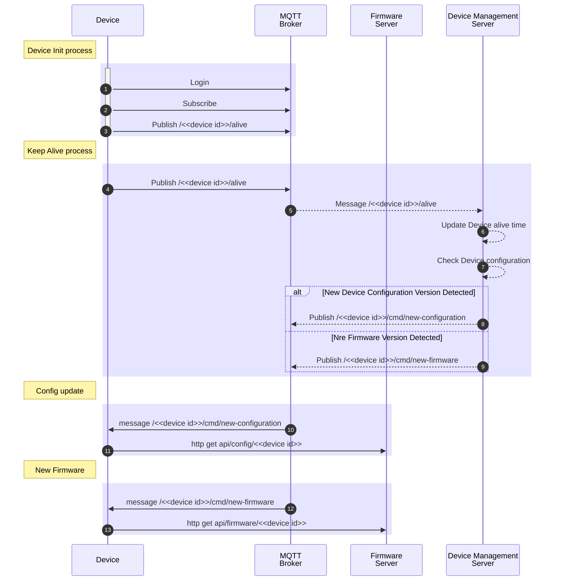

## (ESP8266 | ESP32 ) + DHT22 SENSOR + MQTT

This is a test project that captures DHT22 sensor readings and then send it to a MQTT server.


## Features
- Configurable html console using  [IotWebConf](https://github.com/prampec/IotWebConf)
- JSON Payload to MQTT
- Supports ESP32 and ESP8266

## Dependencies

- [IotWebConf](https://github.com/prampec/IotWebConf) version 3.2.1
- [PubSubClient](https://github.com/knolleary/pubsubclient) version 2.8.0
- [ArduinoJson] (https://arduinojson.org/?utm_source=meta&utm_medium=library.properties) version 6.20.0

## TODO

- [x] Build en GitHub Actions
- [-] Release en GitHub Actions

## Aprovisionamiento / Device provisioning (Planned)
Es la configuración inicial del dispositivo. Como se conecta a internet y al MQTT / Plataforma elegida.

ThingsBoard tiene [opciones para el aprovisionamiento de dispositivos](https://thingsboard.io/docs/user-guide/device-provisioning/). 

Hay que adaptar este ejemplo de código a alguna, creo que la de MQTT es las mas cercana.

## Branching Strategies
TODO: Como se organizan las ramas, ¿usamos PR? ¿podemos tocar la rama main directamente? 


## DevOps / DevSecOps


## CONTINUOUS INTEGRATION + CONTINUOUS DELIVERY (CI / CD)
Para todas las funciones de CI/CD utilizamos PlatformIO en conjunto con GitHub Actions. [Ambas herramientas se encuentra integradas](https://docs.platformio.org/en/latest/integration/ci/github-actions.html#integration). A analizar es la integración de ThingsBoard con lo antes mencionado


- PlatformIO: Plataforma de desarrollo
  - Build
  - Test
  - Análisis estático de código
- GitHub Actions: Orquestación de las pruebas 
- ThingBoards: Repositorio de firmware, delivery de firmware
    

### CONTINUOUS INTEGRATION 

El objetivo de la integración continua es la detección temprana de errores. Identifica problemas en etapas iniciales del desarrollo. Se dispara en eventos como el merge de una rama a main. 

Las acciones de la Integración Continua en DevOps / DevSecOps son:

- Verificación de Código – Análisis estático
    - Compilación, verificar que el código compile sin errores
    - Revisa estándares de codificación.
    - Comprobar librerías desactualizadas o inseguras
- Ejecución de Pruebas (https://docs.platformio.org/en/latest/advanced/unit-testing/runner.html)
    - Pruebas unitarias (PlatformIO las llama nativas, no precisan de un dispositivo)
    - Pruebas de integración (Se ejecutan sobre un dispositivo real)
- Registro y Monitoreo – Genera logs y reportes sobre la calidad del código y estado del build.

Ejemplo de CI con test. https://github.com/platformio/platformio-examples/blob/develop/cicd-setup/.github/workflows/main.yml


```yaml
name: cicd project
on: [push]
jobs:
  build-and-tests:
    name: Build & Tests
    runs-on: ubuntu-latest

    steps:
    - name: Checkout repository
      uses: actions/checkout@v2

    - name: Set up Python
      uses: actions/setup-python@v5
        with:
          python-version: '3.11'
    - name: Install dependencies
      run: |
        python -m pip install --upgrade pip
    - name: Build PlatformIO Project
        run: pio run
    # IMPORTANTE: Hay tres tipos de test en PlatformIO https://docs.platformio.org/en/latest/advanced/unit-testing/runner.html
    - name: Run Unit Tests
      run: platformio test --environment native -f unit -v
    # Este test corre en la nube de PlatformIO, donde hay un dispositivo real 
    - name: Run Integration Tests
      run: platformio remote test --environment uno --ignore unit
      env: 
        PLATFORMIO_AUTH_TOKEN: ${{ secrets.platformioAgent }}
```


## CONTINUOUS DELIVERY 
Para hacer la entrega se tiene que empaquetar la/las versiones (puede que el mismo código sirva para varios dispositivos) y disponibilidarla en uno o varios repositorios.

En este ejemplo se publica el firmware en la sección de releases de GitHub. Hay que agregar la publicación de este firmware en ThingsBoard

### CONTINUOUS DEPLOYMENT

TODO: Revisar este diagrama con lo que esta en [ThingsBoard](https://thingsboard.io/docs/user-guide/ota-updates/)

